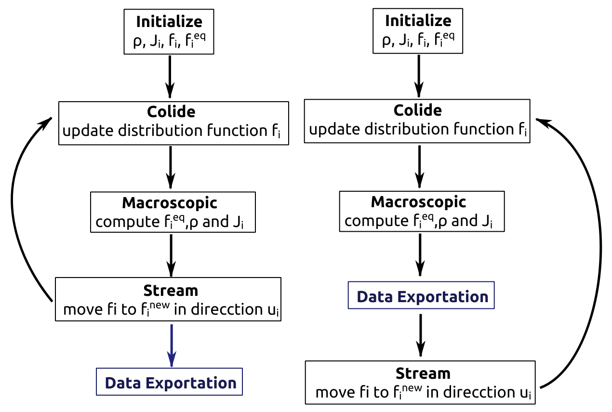

<!-- "## Simulation Protocol ## -->

Lattice Boltzmann Method (LBM) is a Computational Fluid Dynamis (CFD) originated from Automata Celular Method (LGA) and developed in 1990's by Hardy–Pomeau–de Pazzis and Frisch–Hasslacher–Pomeau.
Although this method is relatively new, it has become more popular in the last decade between scientists and engineering due to its versatility to parallelize and model several phenomena. Now exits several LBM software (public and private) that can be used to make CFD, some of them are: Palabos, ProLB, pybm, OpenLB, etc.


# Description

This protocol describes how to implement  LBM in two and three dimensions with absorbing boundaries walls in simple geometries. The idea is to explore how LBM simulates acoustical waves in rectangular geometries and analyze the data generated, using Fourier transform. 

This is just a component of the project, to visit the entire project check our main page on GitHub: [Acoustical Instruments.](https://github.com/saguileran/Acoustics-Instruments)

# Requirements

This code is made in c++ and python language, to run it you have to install g++ compiler; on ubuntu just execute # sudo apt install g++ # in a terminal, on windows you need install VisualC++. Also the OpenMP library is needed but in the majority of cases it come with the compiler. Python language is used to analyze and plot data, for use the PlotData.py script you need to install pandas, numpy and matplotlib library.

To visualaize data three options are evaluted: GNUPLOT, ParaView and OpenCL. The first two just need its corresponding software, while OpenCL need FreeGlut library. 

We recommend to use linux system to execute the code or at least a virutal machine.


# LBM Code

The algorithm used have three principal parts, the recipe. 

* **Stream:** Update distribution function vector for neighbors.

* **Macroscopic:** quantities: Calculate the sum of the ditribution functions,then the sum over weighted distribution functions which are weighted by the velocity components.This is done for each lattice point.In this case we have acoustic waves so the sum of probability density functions is the pressure at each point, and the weighted sum is a vector field proportional  to the time derivative of the mean molecular displacement

* **Colide:** Calculate and update distribution function, this is done at the same time for each lattice point which means that this method could be paralallelized.

<p align="center">
  
</p>

Schematic diagram of LBM steps, the data can be exported in three ways: punctually or  with an "area microphone" (t, rho), also obtaining the density function for all  the grid (x, y, rho). Exporting all the grid data is slower than using micriphones, this data is used for visualization while microphones data is used to analyze the Fourier spectrum.

<p align="center">
  
</p>

## Libraries and LBM constants

Necessary libraries

```c++
#include <iostream>
#include <fstream>
#include <sstream>
#include <cmath>
#include "omp.h"
```
**Lattice system and recorder dimensions**, L for system and LF for recorder. Proportion can be tuned to get bigger system dimensions. The simulation space is a rectangle of dimensions 501x50 while recorder is 330x14, the units are cells but we chose de convertion 1 cell = 1 mm.
```c++
const int proportion = 1;
const int Lx = 501*proportion, Ly = 50*proportion;
const int LFx = 330*(proportion), LFy = 14*(proportion);
const double ke = 0, kF = 1; 
```
**Dimension, velocity weights and auxiliar constants**. There are several models of LBM, depending on whether a bidimensional or tridimensional system is needed, in addition to that for a given dimension one can consider different degrees of freedom, this means the amount of directions to which the particle can stream to.Dependign on the  system that its intended to be implemented ,velocities (Q) and weights (W) are variables that need to be taken into account.This is something that could be calculated but that is accesible through literature as well, in this case  a system of 2 dimensions and 5 degrees of freedom is used.This is seen in the code through 1 direction in which the particle doesn't move and 4 directions that fit a cartesian like axis.
```c++
const int Q = 5;
const double W0 = 1.0 / 3;

const double C = 0.5; // C<0.707 celdas/click
const double TresC2 = 3 * C * C;
const double AUX0 = 1 - TresC2 * (1 - W0);

const double tau = 0.5;
const double Utau = 1.0 / tau;
const double UmUtau = 1 - Utau;
```

## Class

The code is written with object oriented programming but is not optimized. The class name is LatticeBoltzmann and has four vectors associated: velocity (V), weight (W), density function (F), and new density function (Fnew). Moreover some auxiliar functions are defined as well as LBM main functions and data exportation. 
```c++
class LatticeBoltzmann
{
private:
  double w[Q];
  int V[2][Q]; // V[0][i]=V_ix,  V[1][i]=V_iy
  double f[Lx][Ly][Q], fnew[Lx][Ly][Q]; // f[ix][iy][i]
public:
  LatticeBoltzmann(void);
  double rho(int ix, int iy, bool UseNew);
  double  Jx(int ix, int iy, bool UseNew);
  double  Jy(int ix, int iy, bool UseNew);
  double  Jz(int ix, int iy, bool UseNew);
  double feq(double rho0, double Jx0, double Jy0, int i);
  void Colide(void);
  void Stream(void);
  void Initialize(double rho0, double Jx0, double Jy0);
  void ImposeField(int t);
  void PrintGrid(const char * NombreArchivo, int t);
  void Print(int t, int ix, int iy, const char * NombreArchivo);
  void Microphone(int t, int ix, int iy, const char * NombreArchivo);
};
```
## Functions

### Auxiliar Functions

The velocity and weight vectors are define according to dimensions of method, in this case we will use 2 dimensions and 5 veolocities.
```c++
LatticeBoltzmann::LatticeBoltzmann(void){
  w[0] = W0;   w[1] = w[2] = w[3] = w[4] = (1 - W0) / 4.0;
  V[0][0] = 0; V[0][1] = 1;  V[0][2] = 0;  V[0][3] = -1;  V[0][4]=  0;
  V[1][0] = 0; V[1][1] = 0;  V[1][2] = 1;  V[1][3] =  0;  V[1][4]= -1;
}
```
**Macroscopic quantities functions, density function, flux, and equilibrium density function**.Through the procedure of moment matching  one makes an Ansatz for the equilibrium f function by using a weighted series with increasing order of the velocity components, this function is tuned or matched so that the condictions of conservation of mass and momentum are retrieved, which basically assures that we obtain the wave equation at the macroscopic limit
```c++
double LatticeBoltzmann::rho(int ix, int iy, bool UseNew){
  int i; double suma = 0;
    for(i=0;i<Q;i++){if(UseNew) suma += fnew[ix][iy][i]; else suma += f[ix][iy][i]; }
  return suma;
}

double LatticeBoltzmann::Jx(int ix, int iy, bool UseNew){
  int i; double suma;
    for(suma=0,i=0;i<Q;i++){if(UseNew) suma += fnew[ix][iy][i]*V[0][i]; else suma += f[ix][iy][i]*V[0][i]; }
    return suma;
}

double LatticeBoltzmann::Jy(int ix, int iy, bool UseNew){
  int i; double suma;
  for(suma=0,i=0;i<Q;i++){if(UseNew) suma += fnew[ix][iy][i]*V[1][i]; else suma += f[ix][iy][i]*V[1][i];}
  return suma;
}


double LatticeBoltzmann::feq(double rho0, double Jx0, double Jy0, int i){
  if(i==0){ return rho0 * AUX0;}
  else{     return w[i] * (TresC2 * rho0 + 3* (V[0][i] *Jx0 + V[1][i] * Jy0));}
}
```
### Main Functions

**Colide function.** Thsi step is called collision because it comes from the collision term of the Boltzmann equation,it updates the distribution functions according to that equation. The code simulates simple holes (commented lines) in the vertical bar but you can play with it and explore new geometries. A huge disadvantage of this code is when many boundary conditions are defined, this decreases run time considerably, for this reason we suggest implementing few walls. The walls absorbe part of waves depending of FKx (FKy) constants,  it depends on the type of material.

```c++
void LatticeBoltzmann::Colide(void){
  int ix, iy, iz, i; double rho0, Jx0, Jy0;  //for all cell

#pragma omp paralel for
  {
  for(iy=0;iy<Ly;iy++){
    for(ix=0;ix<Lx;ix++){
        //Calcular las cantidades macroscópicas
	rho0 = rho(ix, iy, false);  Jx0 = Jx(ix, iy, false);  Jy0 = Jy(ix, iy, false);
	
	fnew[ix][iy][0] = UmUtau*f[ix][iy][0] + Utau*feq(rho0, Jx0, Jy0, 0);
	//for(i=0; i<Q; i++){ fnew[ix][iy][i] = UmUtau*f[ix][iy][i] + Utau*feq(rho0, Jx0, Jy0, i);}

	//Left flute wall
	if(ix == 20 &&  iy >= Ly/2 - LFy/2 && iy <= Ly/2 + LFy/2 ) {fnew[ix][iy][1] = kF * f[ix][iy][2]; fnew[ix][iy][2] = kF * f[ix][iy][1];}
	else if(ix == Lx - 1 || ix == 1){ fnew[ix][iy][1] = ke * fnew[ix][iy][3]; fnew[ix][iy][3] = ke * fnew[ix][iy][1]; } 
	else{ fnew[ix][iy][1] = UmUtau*f[ix][iy][1] + Utau*feq(rho0, Jx0, Jy0, 1);
    	      fnew[ix][iy][3] = UmUtau*f[ix][iy][3] + Utau*feq(rho0, Jx0, Jy0, 3); }

	//hirizontall fulte walls, the comment lines are the holes
	if(((iy == Ly/2 - LFy/2 && ix >= 20 && ix <= 20 + LFx) || (iy == Ly/2 + LFy/2  &&  ix >= 20 && ix <= 20 + LFx)
	    //&&  not(ix >= 20 + Hole_pos + LFx/3 - Aperture_x/2 && ix <= 20 + Hole_pos + LFx/3 + Aperture_x/2 && iy == Ly/2 + LFy/2)
	    //&&  not(ix >= 20 + Hole_pos - Aperture_x/2 && ix <= 20 + Hole_pos + Aperture_x/2 && iy == Ly/2 + LFy/2)
	    )
	   )
	  {fnew[ix][iy][4] =  kF * fnew[ix][iy][2]; fnew[ix][iy][4] =  kF * fnew[ix][iy][4];}
	else if(iy == Ly - 2 || iy == 1){ fnew[ix][iy][2] = ke *  f[ix][iy][4]; fnew[ix][iy][4] = ke *  f[ix][iy][2]; } 
	else{ fnew[ix][iy][2] = UmUtau*f[ix][iy][2] + Utau*feq(rho0, Jx0, Jy0, 2);
	      fnew[ix][iy][4] = UmUtau*f[ix][iy][4] + Utau*feq(rho0, Jx0, Jy0, 4); }
    }
  }
 }
}
```

**Stream velocities.** At this point the distribution function is updated by the calculations done earlier in the collision step, this mesoscopic movement is done according to the velocity components that are stored for each lattice point in V.

```c++
void LatticeBoltzmann::Stream(void){
  #pragma omp paralel for
  {
  for(int ix=0;ix<Lx;ix++)
    for(int iy=0;iy<Ly;iy++)
      for(int i=0;i<Q;i++)	
	//This condition disable lattice periodicity
	if( ix + V[0][i] < Lx && ix + V[0][i] >= 0 && iy + V[1][i] < Ly && iy + V[1][i] >= 0){ 
	  f[(ix+V[0][i]+Lx)%Lx][(iy+V[1][i]+Ly)%Ly][i] = fnew[ix][iy][i];}
  }
}
```
**Initialize density functions** In order to give the system an initial state
```c++
void LatticeBoltzmann::Initialize(double rho0,double Jx0,double Jy0){
  #pragma omp paralel for
  {
  for(int ix=0;ix<Lx;ix++)
    for(int iy=0;iy<Ly;iy++)
      for(int i=0;i<Q;i++)
	f[ix][iy][i] = feq(rho0, Jx0, Jy0, i);
}
}
```

**Source function**. Here we generate an acoustic source, in this case a senosoidal funtion is chosen with a wavelenght of 10 cells, this wavelenght can vary but with extreme values (too high in comparasion with the lattice size )the system fails to reproduce the wave equation.

```c++
void LatticeBoltzmann::ImposeField(int t){
  int i, ix, iy; double lambda, omega, rho0, Jx0, Jy0;
  
  //sin(omega * t), declare initial function variables
  lambda = 10; omega = 2 * M_PI / lambda; ix = 22 ; iy = (Ly) / 2;

  //Initialize macroscopic cuantities
  rho0 = 10 * sin(omega*t); //Source function
  Jx0 = Jx(ix, iy, false);  Jy0 = Jy(ix, iy, false);

  //make a pulse of 500 steps
  //  if(t < 2000){
    //for(iy=(Ly-LFy+2)/2;iy<(Ly+LFy)/2;iy++){
  for(i=0;i<Q;i++)
    fnew[ix][iy][i] = feq(rho0, Jx0, Jy0, i);
    //    }
    //}
}
```
If you want to test a pulse signal remove the comment in the if condition, also you can have a planar wave (several consecutive points). Furthermore several sources can be defined here, just copy and edit the rho0, Jx0 and Jy0 functions with different coordinates.

## Data exportaton
Export whole density function of grid, it is make to visualize wave propagation
```c++
void LatticeBoltzmann::PrintGrid(const char * NombreArchivo, int t){
  std::ofstream MiArchivo(NombreArchivo + std::to_string(t));
  double rho0, Jx0, Jy0;
  #pragma omp paralel for
  {
  MiArchivo << "X,Y,rho\n";
  for(int ix=0;ix<Lx;ix++){
    for(int iy=0;iy<Ly;iy++){
        rho0 = rho(ix, iy, false);  //Jx0=Jx(ix,iy,iz,false); Jy0=Jy(ix,iy,iz,false); Jz0=Jz(ix,iy,iz,false);
	MiArchivo << ix << "," << iy << "," << rho0 << '\n';
    }
  }
  }
  MiArchivo.close();
}
```
**Export puntual microphone** Here data is stored given a set of coordintes, where to put the microphone, and also the name of the file in which to store it.
```c++
void LatticeBoltzmann::Print(int t, int ix, int iy, const char * NombreArchivo){
  double rho0 = rho(ix, iy, false);
  std::ofstream ofs;
  ofs.open(NombreArchivo, std::ofstream::out | std::ofstream::app);
  ofs << t << ',' << rho0 << '\n';
  ofs.close();
}
```
**Export average of several puntual mirophones** here the average of pressure in a surrounding area to a given point is stored in a file.
```c++
void LatticeBoltzmann::Microphone(int t, int ix, int iy, const char * NombreArchivo){
  double suma = 0; 

  for(int i = 1; i < 4; i++){
    double rho0 = rho(ix + i, iy - 1, false);
    double rho1 = rho(ix + i, iy,     false);
    double rho2 = rho(ix + i, iy + 1, false);

    suma += rho0 + rho1 + rho2;
    }
  suma = suma / 9;
  std::ofstream ofs;
  ofs.open(NombreArchivo, std::ofstream::out | std::ofstream::app);
  ofs << t << '\t' << suma / 9 << '\n';
  ofs.close();
}
```
The last two function generates data of density functions vs time, this data can be analize with Fourier transform.

## Main Function

This section contains the lattice boltzmann execution. You can play with tmax value to get a relaxed system
```c++
int main(void){
  
  LatticeBoltzmann Ondas;  
  int t,tmax=1000;
  
  //GNUPLOT LINES
  
  Ondas.Initialize(0,0,0);
  for(t=0;t<tmax;t++){

    //print actual step
    std::cout << t << std::endl;

    //Making lattice steps
    Ondas.Colide();
    Ondas.ImposeField(t);
    Ondas.Stream();

    //Export microphoes data, time vs pressure
    Ondas.Print(t, Xposition, Yposition, "FileName.dat");

    //Commands to make data animation
    if(t%5 == 0){Ondas.PrintGrid("DataName.csv.", t);}

    //Uncomment to use GNUPLOT animation
    //std::cout << "splot 'Ondas.dat' using 1:2:3  with points palette pointsize 3 pointtype 7 " << std::endl;
  }
  return 0;
}
```
You can define new microphones copying Ondas.Print line and evaluating in other position

## Visualization

### OpenCL

OpenCL is a powerful tool to visualize data but it is a little complex, moreover the perspective tool, for this reason this protocol does not focus in this software but you can find an example code in this link [D2Q5-OpenCL](https://github.com/saguileran/Acoustics-Instruments/tree/master/Simulation/Scripts/D2Q5-OpenCL)


### Gnuplot

The usual way to plot data in c++ scripts is with Gnuplot, to make it you have to add this code lines in the previus function in the //Gnuplot commented line, also is necessary create a pipeline between c++ executing and gnuplot. This is done with the same process present in the below gift but changing *time sudo ./a.out* by *time sudo ./a.out | gnuplot*, this generates a gif with the name pelicula0.

```c++
  std::cout << "set terminal gif animate" << std::endl;
  std::cout << "set output 'pelicula0.gif'" << std::endl;
 
  std::cout << "set pm3d map; set palette color positive" << std::endl;
  std::cout << "set palette defined (-1 \"red\", 0 \"white\", 1 \"blue\")" << std::endl;
  std::cout << "set cbrange[-1:1]" << std::endl;
  std::cout << "set xrange[-1:501]; set yrange[-1:51]; set zrange[-1:1]" << std::endl;
  std::cout << "set view map scale 1 " << std::endl;

  std::cout << "set view map;  set size ratio .9 " << std::endl;
  std::cout << "set object 1 rect from graph 0, graph 0 to graph 1, graph 1 back " << std::endl;
  std::cout << "set object 1 rect fc rgb 'black' fillstyle solid 1.0 " << std::endl;
```
Although Gnuplot is easy to use it does work pertty good for large data.

### ParaView

This option gives us a the possibility to get a good and interactive visualization, ParaView can read xyz files and plot in two or three dimensions.


# Executing Code

To execute the code you first need to download the file from the [Acoustical Instruments.](https://github.com/saguileran/Acoustics-Instruments) repository, downloadng complete, or just the c++ file [D2Q5](https://github.com/saguileran/Acoustics-Instruments/blob/master/Simulation/Scripts/Examples/D2Q5-example.cpp). In the repository you can fnde other scripts examples.

<p align="center">
  
</p>
 
 In the same folder you can find a python LBM unoptimized [D3Q7](https://github.com/saguileran/Acoustics-Instruments/blob/master/Simulation/Scripts/Examples/LB_D3Q7.ipynb), it is vero slowly and doesn't have  a good data visualization.
 
# Data Analyze

With the data generated by the script, the microphone data, you can now process the data with the FT. To make this you will now use a python script [PlotData](https://github.com/saguileran/Acoustics-Instruments/blob/master/Simulation/Scripts/Examples/PlotData.py)

Execute the python codee just with *python PlotData.py*, after execute the command enter the root folder, starting and ending with /, and file name. When the code has finished a new image will appear

<p align="center">
  
</p>
